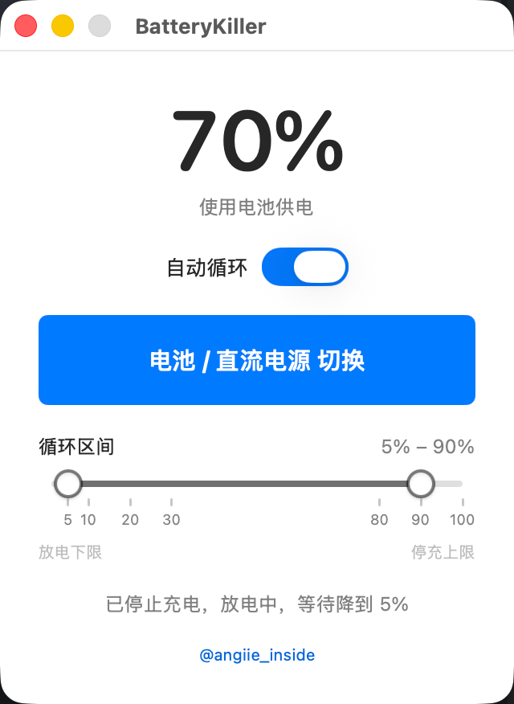
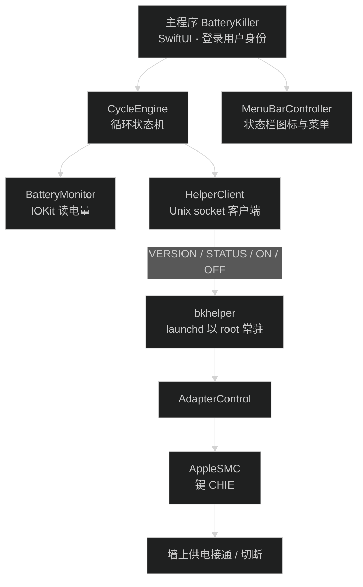
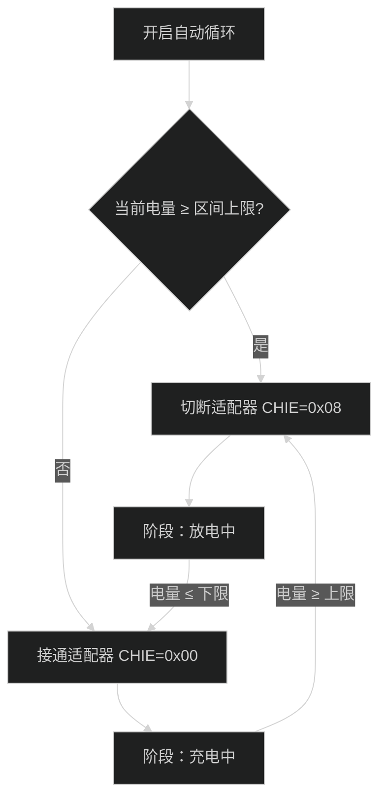
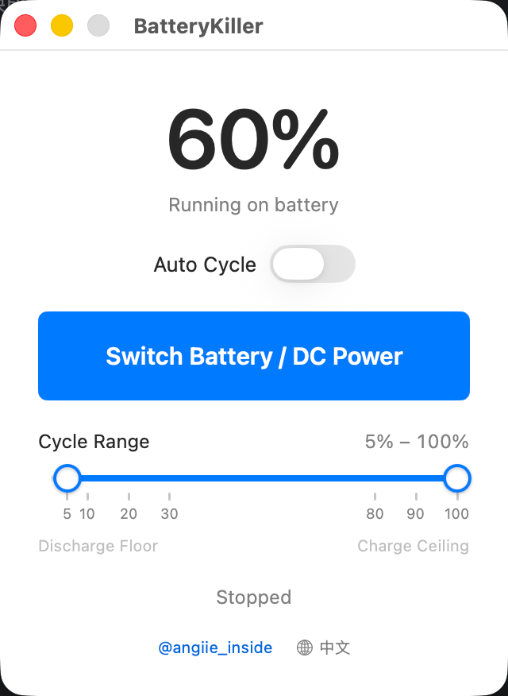
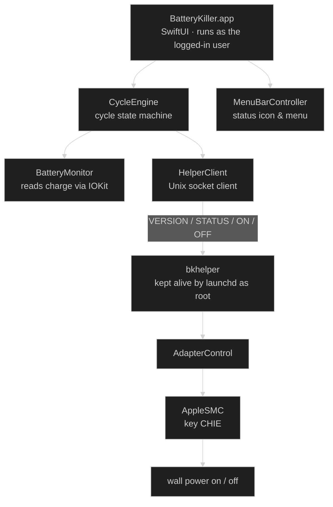
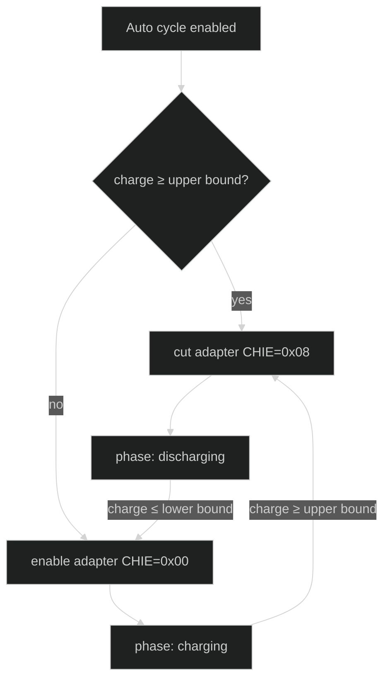

# BatteryKiller

[中文](#中文) · [English](#english)




---

## 中文

### 这是什么

BatteryKiller 是一个 macOS 菜单栏小工具，用软件方式控制 MacBook 的**电源适配器通断**，让电池在指定电量区间内真的放电、真的充电，来回循环；也可以一键在「电池供电」与「直流电源供电」之间切换。

**它不保护电池，恰好相反：它的用途就是消耗电池。** 每切断一次适配器让电池放电、再充回来，都在消耗电池的循环次数、加速老化——名字就是字面意思。它面向的是这类需求：你就是想把这台机器的电池玩坏、想把循环数刷上去，或者需要在真机上又快又可控地把电耗掉。想要延长电池寿命的话，这个工具不是给你用的。

> 适用机型：Apple Silicon（arm64）、macOS 13 及以上。**不支持 Intel Mac**（构建目标就是 arm64）。

### 功能

| 功能 | 说明 |
| --- | --- |
| 自动循环 | 打开开关后，电量升到区间上限就切断墙上供电开始放电，降到下限就恢复供电重新充电，如此往复 |
| 手动切换 | 一个按钮在「电池供电 / 直流电源供电」之间切换，按下即终止正在运行的循环 |
| 循环区间滑杆 | 双滑块选择下限与上限，刻度附近自动吸附到 5 / 10 / 20 / 30 与 80 / 90 / 100 这些常用值；循环运行中锁定，避免中途改区间造成状态错乱 |
| 实时状态 | 大号电量百分比 + 供电状态（正在充电 / 已插电未充电 / 使用电池供电）+ 当前阶段说明 |
| 菜单栏常驻 | 图标随供电方式切换（适配器 / 电池两种配色），菜单里可直接开关循环、切换电源、唤出窗口、退出 |
| 中英双语界面 | 默认跟随系统语言（中文环境中文，其余英文），也可在主界面页脚或菜单栏菜单里手动切换，选择会被记住。界面文案、错误提示、以及特权助手回传的错误文案都会同步切换 |
| 防空闲睡眠 | 循环运行期间申请电源断言，避免机器睡过去导致循环卡死 |
| 退出兜底 | 退出应用前自动恢复墙上供电，不会把机器留在断电状态 |

### 工作原理

一句话概括：**读电量用 IOKit，控电源用 AppleSMC 的 `CHIE` 键，而写 SMC 必须 root，所以配了一个常驻的特权助手。**



#### 1. 控制电源靠的是 SMC 的 `CHIE` 键

macOS 没有公开的「断开充电器」API，实际开关在 AppleSMC 固件里。对本机（M1 / 固件 18000.161.10 / macOS 26.6.2）的全部候选键做快照 diff 后，只有 `CHIE` 会随供电来源变化，其余键（`CHTE` / `CH0D` / `AC-W` / `CHTC`）纹丝不动，据此确定语义：

| 写入值 | 含义 |
| --- | --- |
| `CHIE = 0x00` | 适配器接通，机器走墙上供电 |
| `CHIE = 0x08` | 适配器切断，机器走电池供电（充电器仍物理接着） |

注意 `CHIE` 只表示「电源通路的意愿」，**不表示充电器是否物理接入**；后者要看 `AC-W` 或 IOKit 的电源接口。

#### 2. 为什么必须切断适配器，而不是只停充

本机固件在「只是停充、不断电」的情况下电流为 0、电量根本不会下降，区间循环也就无从谈起。所以到达上限时的动作是**切断适配器**，让电池真实放电。

#### 3. 为什么需要一个 root 助手

实测结论：非 root 进程可以正常打开 AppleSMC 连接、读取任意键的元信息与数据，但**所有写入**都会被内核以 `kIOReturnNotPrivileged` 拒绝（连物理只读的传感器键也一样）。而 GUI 进程始终以登录用户身份运行。

于是把写入拆到一个独立进程 `bkhelper`：

- 由 `launchd` 以 root 常驻拉起，**装机时授权一次即可长期使用**，不会每次操作都弹密码框；
- 对外协议刻意做到最小：一行指令、一行回复，只有 `VERSION` / `STATUS` / `ON` / `OFF` 四条固定指令，指令后仅可跟一个语言标记（`zh` / `en` 白名单），由主程序每次请求携带。即使 socket 被本机其他进程连接，最坏情况也只是被切换一次电源来源；
- 每次请求新建一次 SMC 连接，避免开机时 SMC 尚未就绪导致长连接失效；
- 写入后立即读回比对并校验，因为 SMC 固件存在「谎报成功」的情况。

#### 4. 循环状态机



判定与轮询同频：电量每 5 秒读一次，状态机也跟着每 5 秒判一次，电量越过阈值后一个周期内就会切断或恢复供电。两侧是各自独立的阈值（上限切断、下限恢复），来回穿越同一阈值也不会抖动。

#### 5. 文件结构

```
Sources/
├── BatteryKiller/          主程序（SwiftUI）
│   ├── BatteryKillerApp.swift   应用入口、窗口与退出兜底
│   ├── MenuBarController.swift  状态栏图标与菜单
│   ├── ContentView.swift        主界面
│   ├── LanguageStore.swift      界面语言设置（持久化 + 通知刷新）
│   ├── CycleEngine.swift        循环状态机
│   ├── BatteryMonitor.swift     IOKit 读电池
│   ├── AdapterControl.swift     适配器开关（CHIE）
│   ├── SMC.swift                AppleSMC 用户客户端
│   ├── HelperClient.swift       助手客户端与安装器
│   ├── UnixSocket.swift         Unix socket 地址封装
│   └── RangeSlider.swift        双滑块区间选择器
├── Helper/main.swift       特权助手 bkhelper
└── Shared/
    ├── SMCShim.h           AppleSMC 内核 ABI 的 C 声明
    └── L10n.swift          中英文案表（两个目标共用）
```

### 安装与使用

1. 到 [Releases](https://github.com/angiie/b-killer/releases) 下载最新的安装包，两种格式任选：

   - **`BatteryKiller-vX.Y.Z.dmg`**：双击打开，把 `BatteryKiller` 拖进旁边的「应用程序」
   - **`BatteryKiller-vX.Y.Z.zip`**：解压后把 `BatteryKiller.app` 拖进「应用程序」
2. **首次打开会被 Gatekeeper 拦下**：本项目没有 Apple 开发者签名，也没有做公证，直接双击会提示「无法打开，因为 Apple 无法检查其是否包含恶意软件」。

   两种解法任选其一：

   **右键 → 打开**（图形化，推荐普通用户）

   **终端解除隔离属性**（脚本化，推荐一次性写进部署流程）

   ```bash
   xattr -rd com.apple.quarantine /Applications/BatteryKiller.app
   ```

   > 说明：`com.apple.quarantine` 是浏览器下载文件时打上的隔离标记，Gatekeeper 见到它就要求有效签名。上面这条命令递归（`-r`）清除该属性（`-d`），之后应用即可正常双击启动。只需执行一次，之后升级新版本要再做一次。
   >
   > 注意路径要写你实际放的位置，如果你把应用放在别处，把 `/Applications/BatteryKiller.app` 换成对应路径。

3. 首次点「自动循环」或「直流电源切换」时，会弹出一次管理员授权对话框，用于把特权组件装进系统目录。**只有这一次**，之后不再需要授权。

   安装位置：

   - `/Library/PrivilegedHelperTools/com.bkiller.batterykiller.helper`
   - `/Library/LaunchDaemons/com.bkiller.batterykiller.helper.plist`
   - socket：`/var/run/com.bkiller.batterykiller.helper.sock`
   - 日志：`/var/log/com.bkiller.batterykiller.helper.log`

4. 关掉窗口不影响运行：应用会收起 Dock 图标继续待在菜单栏，只有从菜单栏菜单里「退出 BatteryKiller」才会真正结束。

### 从源码构建

只需要 macOS 自带的 Command Line Tools，无需完整 Xcode：

```bash
xcode-select --install   # 若尚未安装
bash build.sh            # 产物：build/BatteryKiller.app
```

`build.sh` 直接用 `swiftc` 编译（本机只有 Command Line Tools 时 SwiftPM 的 manifest 链接会失败），并顺带：

- 从 `icons/*.svg` 生成 App 图标与状态栏图标；
- 生成助手的 launchd 描述文件；
- 对主程序与助手分别做 ad-hoc 签名。

### 发布新版本

打标签推上去即可，GitHub Actions（[release.yml](.github/workflows/release.yml)）会在 `macos-14` 运行器上自动构建、校验签名与镜像可用性，用 `ditto` 打出 zip、用 `hdiutil` 打出 dmg，并创建 Release：

```bash
git tag v1.0.0
git push origin v1.0.0
```

需要给某个已发布的版本补发产物时，在 Actions 页面手动触发 Release 工作流并填入该标签即可；重复执行不会报错，附件会被覆盖更新。

### 卸载

```bash
sudo launchctl bootout system/com.bkiller.batterykiller.helper
sudo rm -f /Library/LaunchDaemons/com.bkiller.batterykiller.helper.plist
sudo rm -f /Library/PrivilegedHelperTools/com.bkiller.batterykiller.helper
sudo rm -f /var/run/com.bkiller.batterykiller.helper.sock
rm -rf /Applications/BatteryKiller.app
```

### 备注

- 实测环境为 M1 / 固件 18000.161.10 / macOS 26.6.2。`.plist` 里的 `LSMinimumSystemVersion` 是 13.0，但**只有在 `CHIE` 键存在且可写**的机型上才能工作；其他机型启动后会在界面提示「本机不支持软件控制电源适配器」（该判断只读 SMC 元信息，不需要 root，因此不会白弹一次授权框）。
- **应用没有 Apple 开发者签名，也没有公证，Release 里的包是 ad-hoc 签名。**因此首次打开必须右键 → 打开，或先执行 `xattr -rd com.apple.quarantine /Applications/BatteryKiller.app` 解除隔离。这是本项目的现状而非安装出错；每次更新版本后都要再做一次。
- 从早期版本升级时，助手协议版本已提升到 2（指令携带语言标记），因此升级后第一次点「自动循环」或电源切换会再弹一次管理员授权，用于把助手重装成新版本。这是一次性的。
- 基于 SMC 私有键，系统固件更新后行为可能变化，风险自负。
- 参考了 [batt](https://github.com/charlie0129/batt) 的思路，但实现与协议都是独立写的。

---

## English



### What it is

BatteryKiller is a macOS menu bar utility that switches the MacBook **power adapter on and off in software**, so the battery genuinely discharges and genuinely recharges, cycling back and forth inside a range you choose. It can also flip between battery and DC power with one click.

**It does not protect your battery — it exists to wear it out.** Every time the adapter is cut and the battery discharges and recharges, cycle count is consumed and the cell ages faster. The name is literal. It is for the case where you *want* to kill the battery in this machine, push the cycle count up, or need to drain a real Mac quickly and controllably. If you are after longer battery life, this is not the tool for you.

> Requirements: Apple Silicon (arm64), macOS 13 or later. **Intel Macs are not supported** — the build target is arm64.

### Features

| Feature | Description |
| --- | --- |
| Auto cycle | Once enabled, the adapter is cut when the charge hits the upper bound so the battery actually discharges, then restored at the lower bound so it charges again |
| Manual switch | One button toggles between battery power and DC power; pressing it stops a running cycle first |
| Cycle range slider | Two handles pick the lower and upper bounds, snapping to 5 / 10 / 20 / 30 and 80 / 90 / 100 near those ticks. Locked while the cycle runs so the range cannot change mid-cycle |
| Live status | Large charge percentage plus the power state (charging / plugged in but idle / running on battery) and the current cycle phase |
| Menu bar presence | The icon follows the power source (adapter vs. battery artwork). The menu offers cycle toggle, power switch, show window and quit |
| Bilingual UI | Follows the system language by default (Chinese locales get Chinese, everything else English), and can be switched manually from the window footer or the menu bar menu; the choice is remembered. UI strings, error messages, and the error text relayed by the privileged helper all follow the switch |
| Sleep guard | A power assertion is held while cycling, so the Mac does not idle-sleep and freeze the loop |
| Safe exit | The adapter is restored on quit, so the Mac is never left unplugged by accident |

### How it works

In one sentence: **read the charge through IOKit, control the adapter through the AppleSMC `CHIE` key, and because SMC writes require root, ship a small privileged helper.**



#### 1. The adapter is controlled by the SMC key `CHIE`

macOS exposes no public API to cut the charger; the real switch lives in the AppleSMC firmware. Snapshotting every candidate key before and after toggling the adapter on this machine (M1 / firmware 18000.161.10 / macOS 26.6.2) showed that **only `CHIE` changes** — `CHTE`, `CH0D`, `AC-W` and `CHTC` stay put. Hence the semantics:

| Value written | Meaning |
| --- | --- |
| `CHIE = 0x00` | adapter enabled, the Mac runs on wall power |
| `CHIE = 0x08` | adapter cut, the Mac runs on battery (charger still physically attached) |

Note that `CHIE` only expresses the *intent* of the power path. It does **not** mean the charger is physically connected — read `AC-W` or the IOKit power source API for that.

#### 2. Why the adapter has to be cut rather than just "stop charging"

On this firmware, merely stopping the charge keeps the current at 0 and the charge level never drops, which makes range cycling impossible. So hitting the upper bound **cuts the adapter** and lets the battery genuinely discharge.

#### 3. Why a root helper is required

Measured behaviour: a non-root process can open the AppleSMC connection and read key metadata and data just fine, but **every write** is rejected by the kernel with `kIOReturnNotPrivileged` — even for physically read-only sensor keys. The GUI process always runs as the logged-in user.

So all writes live in a separate process, `bkhelper`:

- `launchd` starts it as root and keeps it alive, so the **one authorization happens at install time** instead of on every action;
- the wire protocol is deliberately minimal: one line in, one line out, only four fixed commands (`VERSION` / `STATUS` / `ON` / `OFF`), optionally followed by a language tag (`zh` / `en`, whitelisted) that the app sends with every request. Even if another local process connects to the socket, the worst it can do is flip the power source once;
- each request opens a fresh SMC connection, so a connection established before SMC is ready at boot cannot go stale;
- every write is read back and verified, because the SMC firmware does sometimes report success without applying the change.

#### 4. The cycle state machine



Evaluation runs at the same cadence as polling: the charge is read every 5 seconds and the state machine evaluates on the same tick, so crossing a bound cuts or restores power within one cycle. The two bounds are separate thresholds (cut at the upper, restore at the lower), so a charge hovering at one of them cannot flap.

#### 5. Layout

```
Sources/
├── BatteryKiller/          main app (SwiftUI)
│   ├── BatteryKillerApp.swift   entry point, window and exit handling
│   ├── MenuBarController.swift  status icon and menu
│   ├── ContentView.swift        main window
│   ├── LanguageStore.swift      UI language setting (persistence + refresh)
│   ├── CycleEngine.swift        cycle state machine
│   ├── BatteryMonitor.swift     battery reads via IOKit
│   ├── AdapterControl.swift     adapter switch (CHIE)
│   ├── SMC.swift                AppleSMC user client
│   ├── HelperClient.swift       helper client and installer
│   ├── UnixSocket.swift         sockaddr_un helpers
│   └── RangeSlider.swift        two-handle range slider
├── Helper/main.swift       the privileged helper, bkhelper
└── Shared/
    ├── SMCShim.h           C declarations of the AppleSMC kernel ABI
    └── L10n.swift          Chinese/English string table, shared by both targets
```

### Install and use

1. Grab the latest build from [Releases](https://github.com/angiie/b-killer/releases), in either format:

   - **`BatteryKiller-vX.Y.Z.dmg`**: open it and drag `BatteryKiller` onto the Applications shortcut next to it
   - **`BatteryKiller-vX.Y.Z.zip`**: unzip and drag `BatteryKiller.app` into Applications
2. **The first launch is blocked by Gatekeeper**: this project has no Apple Developer signature and is not notarized, so double-clicking reports "Apple cannot check it for malicious software".

   Pick either fix:

   **Right-click → Open** (graphical, fine for most users)

   **Strip the quarantine attribute in Terminal** (scriptable, good for automated rollouts)

   ```bash
   xattr -rd com.apple.quarantine /Applications/BatteryKiller.app
   ```

   > `com.apple.quarantine` is the flag browsers attach to downloaded files. Gatekeeper sees it and demands a valid signature. The command above recursively (`-r`) deletes (`-d`) that attribute, after which the app launches normally on double-click. It is a one-time fix — repeat it after installing a newer version.
   >
   > Adjust the path if you keep the app somewhere else: replace `/Applications/BatteryKiller.app` with your actual location.

3. The first time you click "Auto Cycle" or the power switch button, macOS asks for an administrator password once, to install the privileged helper. **That is the only time** — no further prompts afterwards.

   Installed paths:

   - `/Library/PrivilegedHelperTools/com.bkiller.batterykiller.helper`
   - `/Library/LaunchDaemons/com.bkiller.batterykiller.helper.plist`
   - socket: `/var/run/com.bkiller.batterykiller.helper.sock`
   - log: `/var/log/com.bkiller.batterykiller.helper.log`

4. Closing the window does not stop anything: the Dock icon disappears and the app keeps running in the menu bar. Only "Quit BatteryKiller" in the menu bar menu really exits.

### Build from source

Only the macOS Command Line Tools are needed — no full Xcode:

```bash
xcode-select --install   # if not installed yet
bash build.sh            # output: build/BatteryKiller.app
```

`build.sh` invokes `swiftc` directly (with only Command Line Tools installed, SwiftPM's manifest linking fails) and also:

- generates the app icon and status bar icons from `icons/*.svg`;
- writes the helper's launchd property list;
- ad-hoc signs the app and the helper separately.

### Releasing

Push a tag and let GitHub Actions ([release.yml](.github/workflows/release.yml)) build on a `macos-14` runner, verify the signature and the mounted image, zip with `ditto`, build a dmg with `hdiutil`, and create the release:

```bash
git tag v1.0.0
git push origin v1.0.0
```

To attach artifacts to an already published version, run the Release workflow manually from the Actions tab and pass that tag. Re-running is safe — the assets are replaced.

### Uninstall

```bash
sudo launchctl bootout system/com.bkiller.batterykiller.helper
sudo rm -f /Library/LaunchDaemons/com.bkiller.batterykiller.helper.plist
sudo rm -f /Library/PrivilegedHelperTools/com.bkiller.batterykiller.helper
sudo rm -f /var/run/com.bkiller.batterykiller.helper.sock
rm -rf /Applications/BatteryKiller.app
```

### Notes

- Verified on M1 / firmware 18000.161.10 / macOS 26.6.2. `LSMinimumSystemVersion` is 13.0, but the app only works on machines where the `CHIE` key exists and is writable. On anything else it reports "This Mac does not support software control of the power adapter" at launch — that probe only reads SMC metadata, needs no root, and therefore never triggers a pointless authorization prompt.
- **The app has no Apple Developer signature and is not notarized; release builds are ad-hoc signed.** So the first launch needs a right-click → Open, or `xattr -rd com.apple.quarantine /Applications/BatteryKiller.app` first. That is the state of the project, not a broken download — and it applies again after every update.
- Upgrading from an earlier version asks for the administrator password once more on the first "Auto Cycle" or power switch, because the helper protocol moved to version 2 (requests now carry a language tag) and the helper must be reinstalled. That prompt is one-off.
- Built on a private SMC key, so a firmware update may change the behaviour. Use at your own risk.
- Inspired by [batt](https://github.com/charlie0129/batt); the implementation and protocol here are written independently.

---

[@angiie_inside](https://x.com/angiie_inside)
